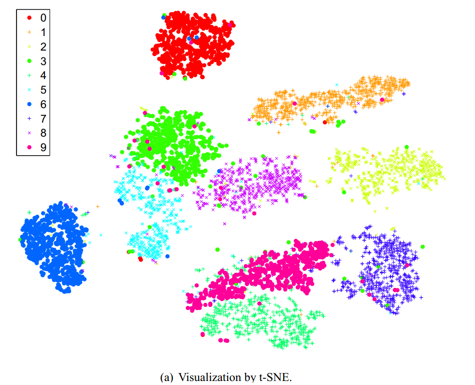
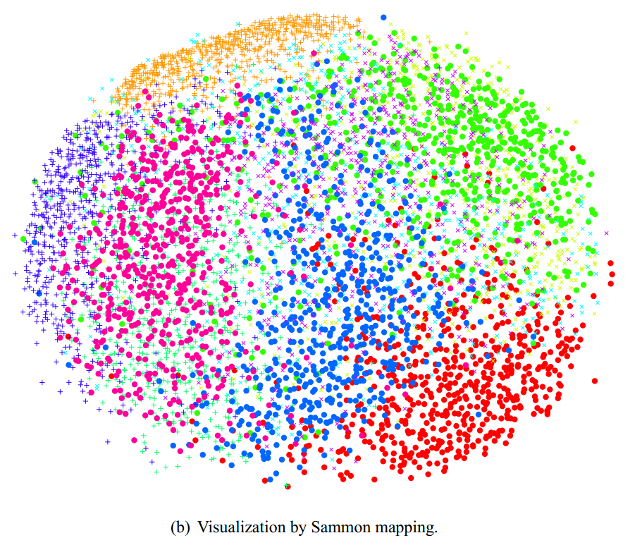
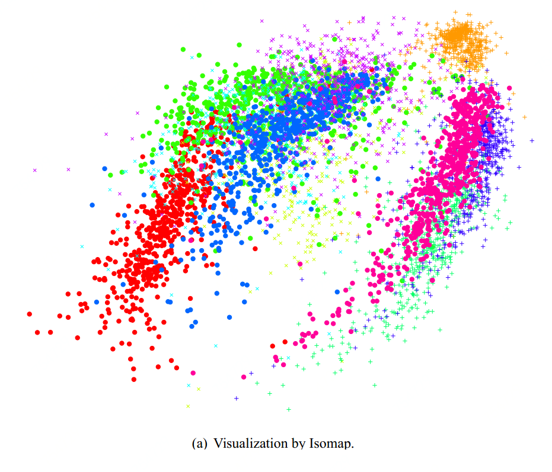
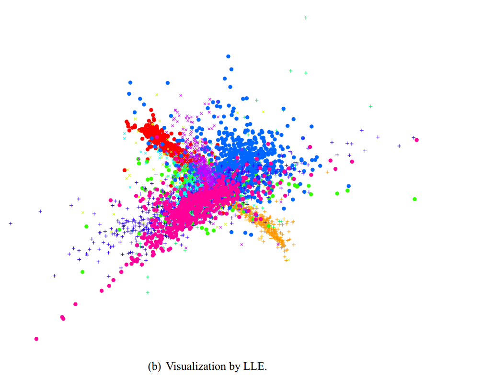
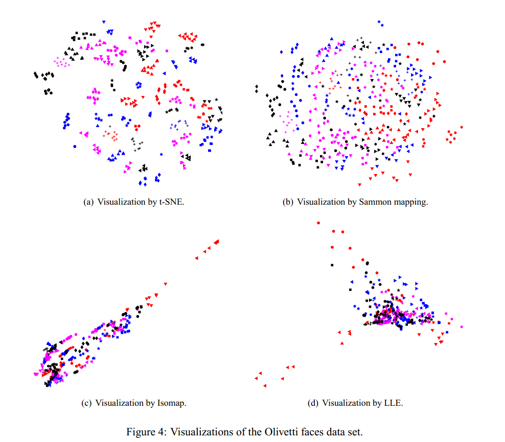
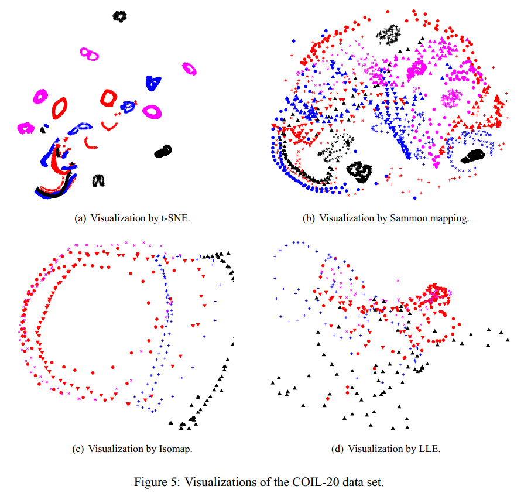
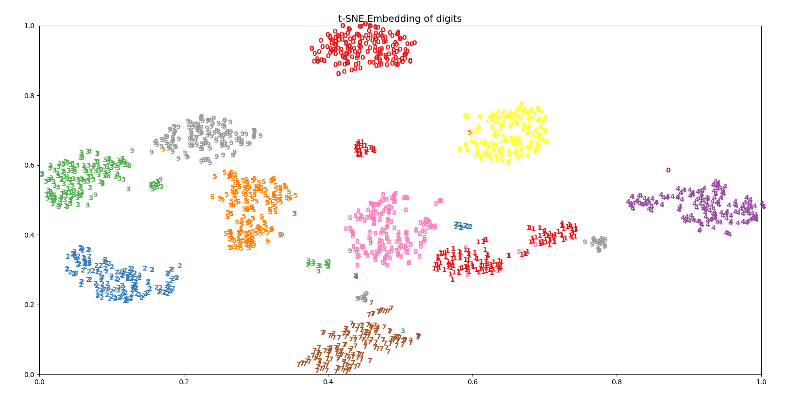

### t-SNE 背景介绍

最易被我们视觉观察到的维数是一维，二维和三维，四维及以上用图形表达都不会那么直观。

然而，现实情况却是随意拿个数据集，都有上千上百个维度。比如，经典的`MNIST`维度是`64`，所以使用二维的笛卡尔坐标系，注定无法绘制64个维度。

当我们想对高维数据集进行分类，但又不清楚这个数据集有没有很好的可分性（同类之间间隔小、异类之间间隔大）时，可以通过降维算法将数据投影到二维或三维空间中。

很久以前，就有人提出一种降维算法，主成分分析(`PCA`) 降维法，中间其他的降维算法陆续出现，比如 多维缩放(MDS)，线性判别分析(LDA)，等度量映射(Isomap)。

等时间来到2008年，另外一个和我们比较熟悉的大牛 Geoffrey Hinton在 2008 年一同提出了t-SNE 算法。


他们改进SNE算法为t-SNE算法，并使它在降维领域得到更广泛的应用。

### t-SNE 算法概述

全称为 t-distributed Stochastic Neighbor Embedding，翻译为 `t分布-随机邻近嵌入`。

怎么理解这个名字？

首先，`t-分布`是关于样本(而非总体)的t 变换值的分布，它是对u 变换变量值的标准正态分布的估计分布，是一位学生首先提出的，所以 t-分布全称：学生t-分布。

其次，t-SNE本质是一种嵌入模型，能够将高维空间中的数据映射到低维空间中，并保留数据集的`局部特性`。t-SNE 可以算是目前效果很好的数据降维和可视化方法之一。

缺点主要是占用内存较多、运行时间长。

t-SNE变换后，如果在低维空间中具有可分性，则数据是可分的；如果在低维空间中不可分，则可能是因为数据集本身不可分，或者数据集中的数据不适合投影到低维空间。

该算法在论文中非常常见，主要用于**高维数据的降维和可视化**。

Visualizing Data using t-SNE，2008年发表在Journal of Machine Learning Research，大神Hinton的文章：


http://www.jmlr.org/papers/v9/vandermaaten08a.html

### t-SNE 原理描述

t-SNE将数据点之间的相似度转化为`条件概率`，原始空间中数据点的相似度由`高斯联合分布`表示，嵌入空间中数据点的相似度由`学生t分布` 表示。

通过原始空间和嵌入空间的联合概率分布的`KL散度`（用于评估两个分布的相似度的指标，经常用于评估机器学习模型的好坏）来评估嵌入效果的好坏。

也就是，将有关`KL散度的函数`作为损失函数（loss function），通过梯度下降算法最小化损失函数，最终获得收敛结果。


### t-SNE 精华所在

t-SNE的精华都在以下这些文字：

在文中提到的论文中，主要讨论降维出现的拥挤问题，解决的方法也很巧妙，一旦理解它后就明白为什么叫t-分布随机近邻嵌入。

如果想象在一个三维的球里面有均匀分布的点，不难想象，如果把这些点投影到一个二维的圆上一定会有很多点是重合的。

所以，为了在二维的圆上想尽可能表达出三维里的点的信息，大神Hinton采取的方法：

`把由于投影所重合的点用不同的距离（差别很小）表示。`

这样就会占用原来在那些距离上的点，原来那些点会被赶到更远一点的地方。

t分布是长尾的，意味着距离更远的点依然能给出和高斯分布下距离小的点相同的概率值。

**从而达到高维空间和低维空间对应的点概率相同的目的。**


### t-SNE降维对比分析

以MNIST数据集，降维并可视化为例，可以看到t-SNE 算法明显好于其他降维算法：










在人脸数据集olivertti 上表现：





在哥伦比亚大学 Columbia University Image Library (COIL-20) 数据集上的表现：




### sklearn实现t-SNE


```python
import numpy as np
import matplotlib.pyplot as plt
from sklearn import datasets
from sklearn.manifold import TSNE


# 加载数据
def get_data():
	"""
	:return: 数据集、标签、样本数量、特征数量
	"""
	digits = datasets.load_digits(n_class=10)
	data = digits.data		# 图片特征
	label = digits.target		# 图片标签
	n_samples, n_features = data.shape		# 数据集的形状
	return data, label, n_samples, n_features


# 对样本进行预处理并画图
def plot_embedding(data, label, title):
	"""
	:param data:数据集
	:param label:样本标签
	:param title:图像标题
	:return:图像
	"""
	x_min, x_max = np.min(data, 0), np.max(data, 0)
	data = (data - x_min) / (x_max - x_min)		# 对数据进行归一化处理
	fig = plt.figure()		# 创建图形实例
	ax = plt.subplot(111)		# 创建子图
	# 遍历所有样本
	for i in range(data.shape[0]):
		# 在图中为每个数据点画出标签
		plt.text(data[i, 0], data[i, 1], str(label[i]), color=plt.cm.Set1(label[i] / 10),
				 fontdict={'weight': 'bold', 'size': 10})
	plt.xticks()		# 指定坐标的刻度
	plt.yticks()
	plt.title(title, fontsize=14)
	# 返回值
	return fig


# 主函数，执行t-SNE降维
def main():
	data, label , n_samples, n_features = get_data()		# 调用函数，获取数据集信息
	print('Starting compute t-SNE Embedding...')
	ts = TSNE(n_components=2, init='pca', random_state=0)
	# t-SNE降维
	reslut = ts.fit_transform(data)
	# 调用函数，绘制图像
	fig = plot_embedding(reslut, label, 't-SNE Embedding of digits')
	# 显示图像
	plt.show()


# 主函数
if __name__ == '__main__':
	main()

```

结果：




